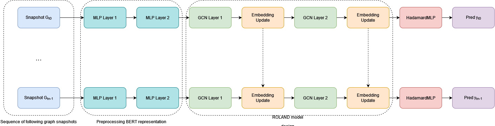

# Dynamic-gnn
PyTorch Geometric implementation of a dynamic gnn based on Roland framework.

The model is designed for solving link prediction tasks on temporal attributed directed graph. 

## Architecture overview
This work is largely inspired by ["ROLAND: Graph Learning Framework for Dynamic Graphs"](https://dl.acm.org/doi/abs/10.1145/3534678.3539300). To have a general idea of how our model works, you can refer to the paper by You et al. The figure below shows the running architecture of our dynamic gnn model.
.

## Embedding update module
You can update the node embeddings along the time snapshosts in different ways. You can use the parameter `update` during the inizialization of the model to decide which kind of embedding update module will act. Below we will refer to $H_{t}^{(l)}$ as the node embeddings at gnn-layer $l$ and time snapshot $t$.
- Setting `update` to `mlp`, node embeddings are updated by a 1-layer MLP (default option); $H_{t}^{(l)} = MLP(CONCAT(H_{t-1}^{(l)},H_{t}^{(l)}))$.
- Setting `update` to `gru`, node embeddings are updated by a GRU Cell having $H_{t-1}^{(l)}$ as hidden state and $H_{t}^{(l)}$ as input.
- Setting `update` to `lwa` (learnable weighted average), node embeddings are updated using a weighted sum $H_{t}^{(l)} = \tau  H_{t-1}^{(l)} + (1-\tau) H_{t}^{(l)}$ where $\tau$ is a learnable parameter. Setting `update` to a number between zero and one results in a constant value for $\tau$.

## Running example
A complete running example with datasets, train and test procedures is available on `BitcoinOTC-Example.ipynb` notebook. Information about the dataset can be found in ["EvolveGCN: Evolving Graph Convolutional Networks for Dynamic Graphs"](https://arxiv.org/pdf/1902.10191.pdf). I ran the ROLAND-based model on all the 138 snapshots using a constant encoder as node features and a GRU Cell as embedding update module. The results along the snapshots and over time are reported in AUPRC as suggested in ["Evaluating Link Prediction methods"](https://arxiv.org/pdf/1505.04094.pdf). 

## Paper
This model was used in the following works:
- Temporal Graph Learning for Dynamic Link Prediction with Text in Online Social Networks, submitted at the Machine Learning Journal - Special Issue on Discovery Science. 

## BOSN Data
Due to privacy reasons, we can't release the dataset related to Steemit. To patch this problem, we are working to provide an anonymized version of our data in agreement with the ethics committee. In the meantime, for data gathering you can refer to the [Steemit API](https://developers.steem.io/) documentation.

